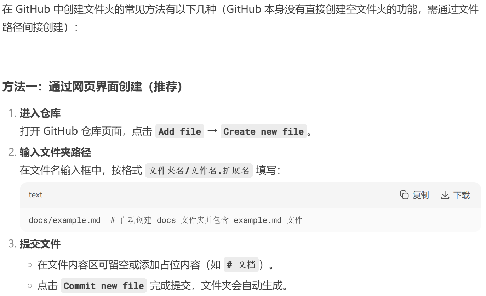
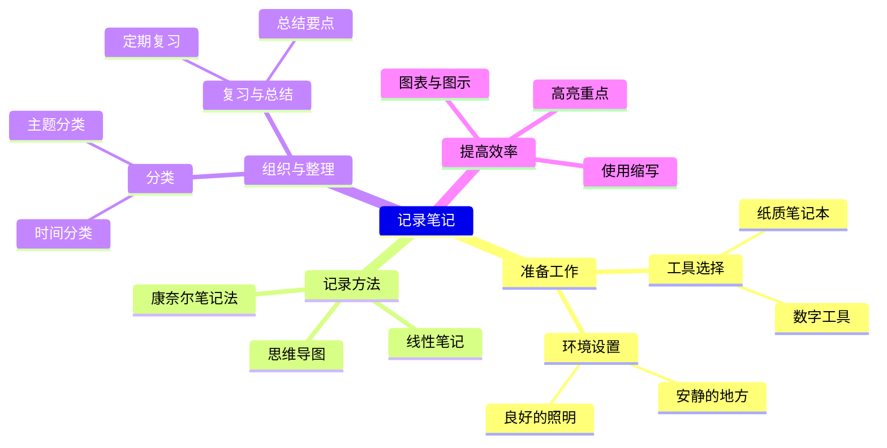

# Learning about *Markdown Language*

Basic learning materials as follows:
- [Cmd Markdown 公式指导手册](https://www.zybuluo.com/codeep/note/163962)：
Including expressions for lots of formulas.
- [Cmd Markdown 简明语法手册](https://www.zybuluo.com/mdeditor?url=https://www.zybuluo.com/static/editor/md-help.markdown):
Including basic introduction to baisc syntaxs.
- [flowchart.js](https://github.com/adrai/flowchart.js)
Including lessons for flow chart.
  
## Basic Syntex
### 1. 格式
    四个空格插入代码块，用`...`表示行内代码块
`行内代码块`
    
    用<!--和-->包含不想显示的部分

`空行`或者`<p>`表示下一段落.  
用`行尾加两个空格并enter键`或者`<br>`来换行，但是仍然渲染为一个段落结构.

用 - 或 * 表示无序列表，数字加 . 表示有序列表。

使用 * 和 ** 表示斜体和粗体。

删除线~~这是一段错误的文本。~~

### 2. 其他内容的插入
插入图片
ps.原生 Markdown 不支持直接设置图片大小、旋转等属性

插入流程图
```flow
st=>start: Start:>https://www.zybuluo.com
io=>inputoutput: verification
op=>operation: Your Operation
cond=>condition: Yes or No?
sub=>subroutine: Your Subroutine
e=>end

st->io->op->cond
cond(yes)->e
cond(no)->sub->io
```

更多语法参考：[流程图语法参考](http://adrai.github.io/flowchart.js/)

插入思维导图


更多语法参考：[思维导图语法参考](https://mermaid.js.org/syntax/mindmap.html)

    同样支持'''python, '''JavaScipt等.
